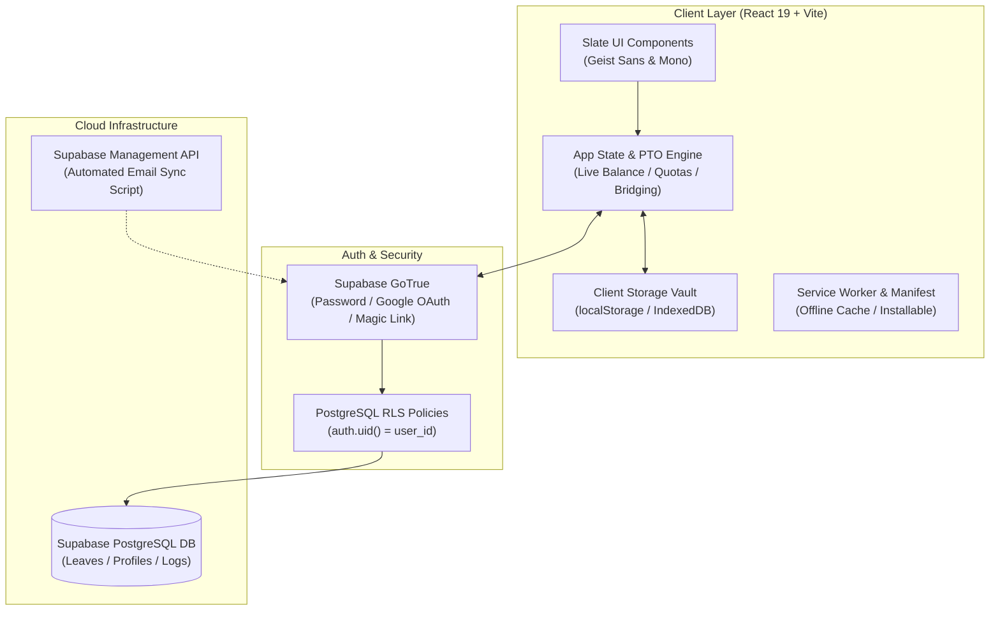

<div align="center">

<br/>


<br/>
<br/>

# Leave Planner & Vault

### Precision PTO Engine & Modern Leave Optimization Client

<br/>

[](https://sba-leaveplanner.vercel.app)
[](LICENSE)
[](https://react.dev/)
[](https://vitejs.dev/)
[](https://supabase.com)
[](DESIGN_SYSTEM.md)

<br/>

[**Live Demo**](https://sba-leaveplanner.vercel.app) · [**Features**](#features) · [**Architecture**](#architecture) · [**Design System**](#design-system) · [**Getting Started**](#getting-started) · [**Security & Privacy**](#security--privacy) · [**License**](#license)

<br/>

</div>

> [!NOTE]
> **Zero Telemetry & Private by Design**: Leave Planner encrypts local data on-device and isolates cloud storage via Supabase Row-Level Security (RLS). We never sell your schedules, run tracking pixels, or inspect your personal calendar balances.

---

<div align="center">

<h1><a id="features"></a>Platform Features</h1>

</div>

<table>
  <tr>
    <td width="50%" valign="top">

#### 📅 Smart Calendar & PTO Engine
- **Multi-day drag & click selection** to schedule trips and multi-week vacations effortlessly.
- **Automated holiday bridge detection** that spots upcoming long weekends and holiday overlaps to maximize vacation time with minimal balance loss.
- **Dynamic balance meters** for Paid Leave (PL), Casual Leave (CL), Sick Leave (SL), and Restricted Holidays (RH).
- **Burnout safeguards & consecutive-day alerts** warning users before consecutive emergency leaves violate policy thresholds.

#### ☁️ Cloud Sync & Multi-Device Auth
- **Supabase Authentication** supporting Email/Password with real-time strength auditing, Google OAuth, and passwordless Magic Links.
- **Row-Level Security (RLS)** strictly guarantees every user can only read, insert, update, and delete their own records.
- **Guest Demo Sandbox**: Zero-friction local mode to explore full functionality without signing up, with one-click demo data reset.
- **Automated email synchronization** keeping branded transaction emails directly synced via the Supabase Management API.

</td>
<td width="50%" valign="top">

#### 🎨 Slate Design System Aesthetics
- **Non-warping morphing surfaces** using Framer Motion `layout="size"` to smoothly transition bottom docks, drawers, and modal panels.
- **Monospaced typographic density** pairing Vercel **Geist Sans** with **Geist Mono** for numeric metrics and dates.
- **Fluid tumbler selectors** for intuitive tactile touch quota adjustments.
- **True OLED dark canvas** (`#09090b` canvas, `#121214` cards, `#27272a` borders) with crisp translucent glass treatments.

#### 📦 Portability, Backup & PWA
- **Complete JSON vault export & import** allowing instant zero-loss migration or backup hydration across machines.
- **Spreadsheet-ready CSV export** to share audit trails with HR or project leads.
- **Progressive Web App (PWA)** installable directly to iOS home screen, Android, macOS, or Windows with offline asset caching.
- **Self-service GDPR data erasure**: Clean 1-click account and data purge right from the settings panel.

</td>
  </tr>
</table>

---

## <a id="architecture"></a>Architecture



---

## <a id="design-system"></a>Design System

Leave Planner is built from the ground up on the **Slate Design System (v0.8.0)**:
- **Typography Tokens**: Vercel `Geist Sans` for structural interfaces and `Geist Mono` for numeric metrics, dates, and micro-badges.
- **Color Architecture**: Precision dark mode using `#09090b` canvas, `#121214` elevated cards, `#18181b` muted components, and `#27272a` borders.
- **Motion Parameters**: Strict non-warping Framer Motion spring curves preventing typography distortion during container morphs.

For full design tokens, Tailwind mappings, and component conventions, read [DESIGN_SYSTEM.md](DESIGN_SYSTEM.md).

---

## <a id="getting-started"></a>Getting Started

### Prerequisites
- [Node.js](https://nodejs.org/) (v18.0.0 or higher)
- [npm](https://www.npmjs.com/) or [yarn](https://yarnpkg.com/)
- A free [Supabase](https://supabase.com) project (for cloud sync & auth)

### 1. Clone the repository
```bash
git clone https://github.com/shotbyadii/leave-planner.git
cd leave-planner
```

### 2. Install dependencies
```bash
npm install
```

### 3. Configure environment variables
Create a `.env.local` file in the project root:
```env
# Supabase Configuration
VITE_SUPABASE_URL="https://your-project.supabase.co"
VITE_SUPABASE_ANON_KEY="your-anon-key"

# Gemini AI (Optional / Assistant features)
VITE_GEMINI_API_KEY=""

# Supabase Management API (Optional / For automatic email template sync)
SUPABASE_ACCESS_TOKEN="sbp_xxxxxxxxxxxx"
SUPABASE_PROJECT_REF="your-project-ref"
```

### 4. Run the development server
```bash
npm run dev
```
Open [http://localhost:5173](http://localhost:5173) in your browser.

### 5. Build for production
```bash
npm run build
```

---

## 🛠️ Project Scripts

| Script | Purpose |
| :--- | :--- |
| `npm run dev` | Launches the local Vite development server with HMR. |
| `npm run build` | Builds the optimized production bundle with tree-shaking into `dist/`. |
| `npm run preview` | Locally serves the production `dist/` build. |
| `npm run sync:emails` | Automatically uploads branded Slate email templates to Supabase via Management API. |
| `npm run lint` | Runs ESLint across the codebase. |

---

## <a id="security--privacy"></a>Security & Privacy

- **Row Level Security (RLS)**: Enforced directly on PostgreSQL so no user can access another user's leave records under any condition.
- **Privacy Policy**: [Read our full Privacy Policy](https://sba-leaveplanner.vercel.app/privacy)
- **Terms of Service**: [Read our Terms of Service](https://sba-leaveplanner.vercel.app/terms)

---

## <a id="license"></a>License

Distributed under the **MIT License**. See [`LICENSE`](LICENSE) for complete details.

```
Copyright (c) 2026 Aditya (shotbyadii)
```

---

<div align="center">
  <sub>Built with care for effortless vacation planning. Crafted with the Slate Design System.</sub>
</div>
