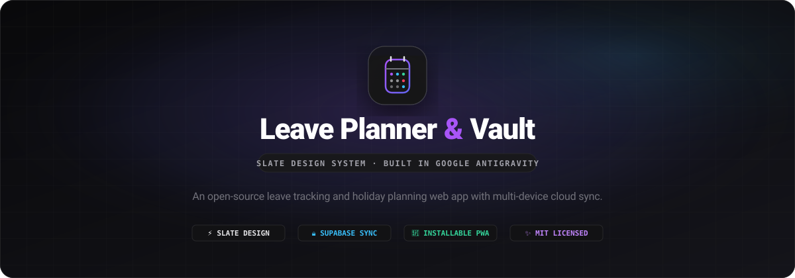
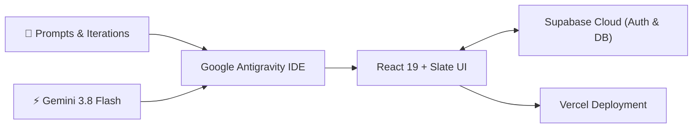

<div align="center">

<br/>



<br/>
<br/>

# Leave Planner & Vault

### An open-source leave tracking and holiday planning web app.

<br/>

[](https://sba-leaveplanner.vercel.app)
[](https://antigravity.google)
[](https://deepmind.google/technologies/gemini/)
[](LICENSE)
[](https://react.dev/)
[](https://supabase.com)

<br/>

[**Live Demo**](https://sba-leaveplanner.vercel.app) · [**Features**](#features) · [**How It Was Built**](#how-it-was-built) · [**Design System**](#design-system) · [**Getting Started**](#getting-started) · [**Privacy**](#privacy) · [**License**](#license)

<br/>

</div>

> [!NOTE]
> **A Vibe-Coded Experiment**:
> This project is a vibe-coded experiment created entirely inside **Google Antigravity**, powered by Google's **Gemini models (Gemini 3.8 Flash)**. The application, design system tokens, Supabase database bindings, PWA configuration, and automated tooling were developed iteratively through natural language pair programming.

---

<div align="center">

<h1><a id="features"></a>What It Does</h1>

</div>

<table>
  <tr>
    <td width="50%" valign="top">

#### 📅 Interactive Calendar & Leave Planning
- **Click & drag multi-day selection** to quickly schedule trips and time off across months.
- **Holiday & weekend bridge highlights** showing upcoming long weekends so you can maximize vacation days.
- **Live balance tracking** for Paid Leave, Casual Leave, Sick Leave, and Restricted Holidays.
- **Consecutive leave alerts** that give you a heads-up when back-to-back leaves cross threshold limits.

#### ☁️ Accounts & Multi-Device Sync
- **Supabase Authentication** with support for Email/Password, Google Sign-In, and Magic Links.
- **Guest Sandbox / Demo Mode**: Explore all features immediately with pre-filled mock data without signing in. One-click reset to start fresh anytime.
- **Row-Level Security (RLS)** ensuring your saved leave data is strictly private to your account.
- **Automated email template syncing** with Supabase using the Supabase Management API.

</td>
<td width="50%" valign="top">

#### 🎨 Slate Design Aesthetic
- **Minimalist dark mode interface** (`#09090b` background, `#121214` cards, `#27272a` borders) with glass backdrops.
- **Clean typography**: Pairings of Vercel **Geist Sans** for interface labels and **Geist Mono** for dates and numbers.
- **Smooth animations** powered by Framer Motion, keeping bottom sheets, docks, and modals feeling fluid.
- **Touch-friendly tumbler pickers** for setting quota numbers quickly on mobile and desktop.

#### 📦 Backups, Exports & PWA
- **JSON vault export & import** to easily backup all your records or transfer them between devices.
- **CSV export** for downloading spreadsheet-friendly summaries of your leaves.
- **Installable Progressive Web App (PWA)** that can be added to your home screen on iOS, Android, or desktop.
- **Account data deletion**: Clean one-click option in settings to erase your account and associated data.

</td>
  </tr>
</table>

---

## <a id="how-it-was-built"></a>How It Was Built



- **Built with**: Google Antigravity paired with Gemini 3.8 Flash
- **Frontend**: React 19, Vite 8, Tailwind CSS, Framer Motion, Lucide Icons
- **Fonts**: `@fontsource/geist-sans` and `@fontsource/geist-mono`
- **Backend / Database**: Supabase (PostgreSQL, GoTrue Auth, Row-Level Security)
- **Hosting**: Vercel

---

## <a id="design-system"></a>Design System

Leave Planner uses the custom **Slate Design System**:
- **Palette**: Dark canvas (`#09090b`), surface card (`#121214`), muted background (`#18181b`), and borders (`#27272a`).
- **Typography**: `Geist Sans` for structural UI and `Geist Mono` for numbers, dates, and quotas.
- **Motion**: Framer Motion layout transitions without layout distortion.

Check out [DESIGN_SYSTEM.md](DESIGN_SYSTEM.md) for full design system details.

---

## <a id="getting-started"></a>Getting Started

### Prerequisites
- [Node.js](https://nodejs.org/) (v18.0.0 or higher)
- [npm](https://www.npmjs.com/) or [yarn](https://yarnpkg.com/)
- A free [Supabase](https://supabase.com) project (for cloud sync & auth)

### 1. Clone the repository
```bash
git clone https://github.com/shotbyadii/leave-planner.git
cd leave-planner
```

### 2. Install dependencies
```bash
npm install
```

### 3. Add environment variables
Create a `.env.local` file in the root folder:
```env
# Supabase Configuration
VITE_SUPABASE_URL="https://your-project.supabase.co"
VITE_SUPABASE_ANON_KEY="your-anon-key"

# Optional: Supabase Management API (for automatic email template syncing)
SUPABASE_ACCESS_TOKEN="sbp_xxxxxxxxxxxx"
SUPABASE_PROJECT_REF="your-project-ref"
```

### 4. Run the development server
```bash
npm run dev
```
Open [http://localhost:5173](http://localhost:5173) in your browser.

### 5. Build for production
```bash
npm run build
```

---

## 🛠️ Project Scripts

| Script | Purpose |
| :--- | :--- |
| `npm run dev` | Runs the local development server. |
| `npm run build` | Builds the production bundle to `dist/`. |
| `npm run preview` | Previews the production build locally. |
| `npm run sync:emails` | Syncs branded email templates directly to your Supabase project. |
| `npm run lint` | Runs ESLint. |

---

## <a id="privacy"></a>Privacy

- Your leaves are private to your account and protected by PostgreSQL Row Level Security (RLS).
- No tracking scripts, analytics cookies, or third-party ad networks.
- [Privacy Policy](https://sba-leaveplanner.vercel.app/privacy) · [Terms of Service](https://sba-leaveplanner.vercel.app/terms)

---

## <a id="license"></a>License

Distributed under the **MIT License**. See [`LICENSE`](LICENSE) for details.

```
Copyright (c) 2026 Aditya (shotbyadii)
```

---

<div align="center">
  <sub>A vibe-coded experiment built with Google Antigravity &amp; Gemini Flash.</sub>
</div>
